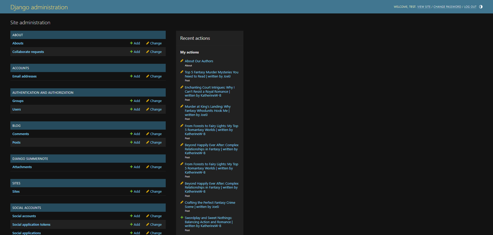
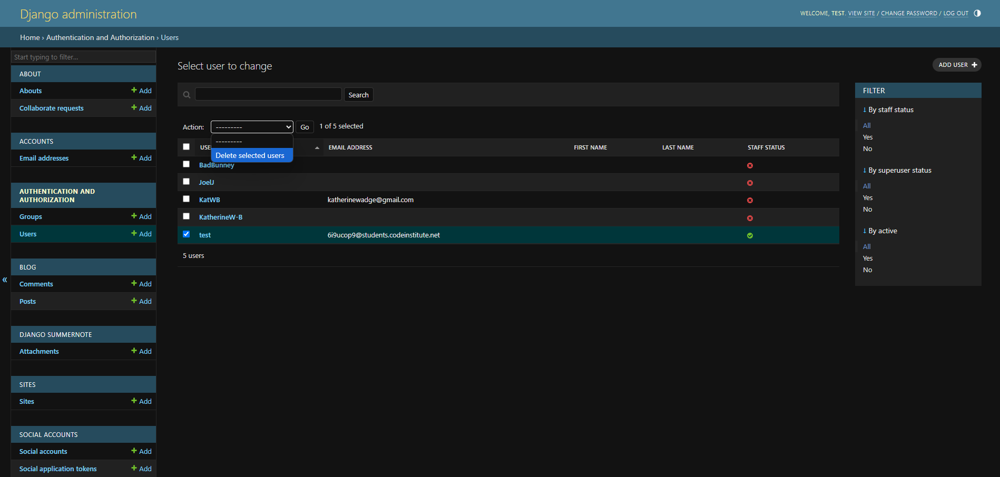
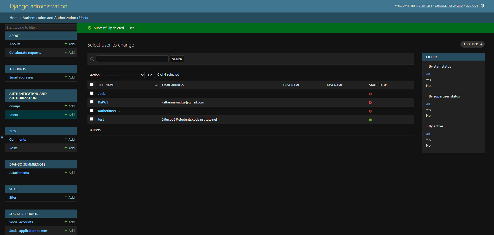

# Away with the Faeries – A Fantasy Blog

Welcome to a realm of whispered lore, enchanted tales, and wanderings through faerie-tinged forests.

[Live Application](https://)

## Table of Contents:
1. [User Experience (UX)](#user-experience-ux)
    * [User Stories](#user-stories)
    * [Wireframes](#wireframes)
    * [Agile Methodology](#agile-methodology)
2. [Design](#design)
3. [Features](#features)
4. [Technologies Used](#technologies-used)
5. [Libraries](#libraries-used)
6. [Testing](#testing)
7. [Bugs](#bugs)
8. [Deployment](#deployment)
9. [Credits](#credits)
10. [Acknowledgments](#acknowledgments)

---

## **User Experience (UX)**
On the homepage greets visitors with 6 initial blog posts with short excerpts that entice the reader to click for the full story. A message in the top-right corner informs visitors if they are logged in, and gets non-registered visitors to create an account.

### **User Stories**

#### **Navigation**
(include screenshots of nav bar and description)

#### **Milestones**
##### View posts and homepage
- As a site user, I can view a paginated list of posts so that I can select which post I want to view.
- As a Site User, I can click on a post so that I can read the full text.
- As a site visitor (or content author), I want the blog’s design to reflect a fantasy aesthetic so that the look and feel matches the content and enhances immersion.

##### About us page
- As a Site Admin, I can create or update the about page content so that it is available on the site.
- As a Site User, I can click on the About link so that I can read about the site.
- As a Potential Collaborator, I can fill in a contact form so that I can submit a request for collaboration.

##### Visitor interactions
- As a Site User I can register an account so that I can comment on a post.
- As a Site User I can leave comments on a post so that I can be involved in the conversation.
- As a Site User I can modify or delete my comment on a post so that I can be involved in the conversation.
- As a registered reader, I want to click a “like” button on any blog post so that I can show appreciation for content and authors.

##### Django admin
- As a Site Admin I can create draft posts so that I can finish writing the content later.
- As a Site Admin I can create, read, update and delete posts so that I can manage my blog content.
- As a Site Admin I can approve or disapprove comments so that I can filter out objectionable comments.
- As a Site User / Admin I can view comments on an individual post so that I can read the conversation
- As a Site Owner, I can store collaboration requests in the database so that I can review them.

### **Admin Panel**
In the Django Admin Panel, authorised users can perform all CRUD operations on Users, Posts, Comments, and Collaboration Requests to keep the site a safe and friendly place for all.

